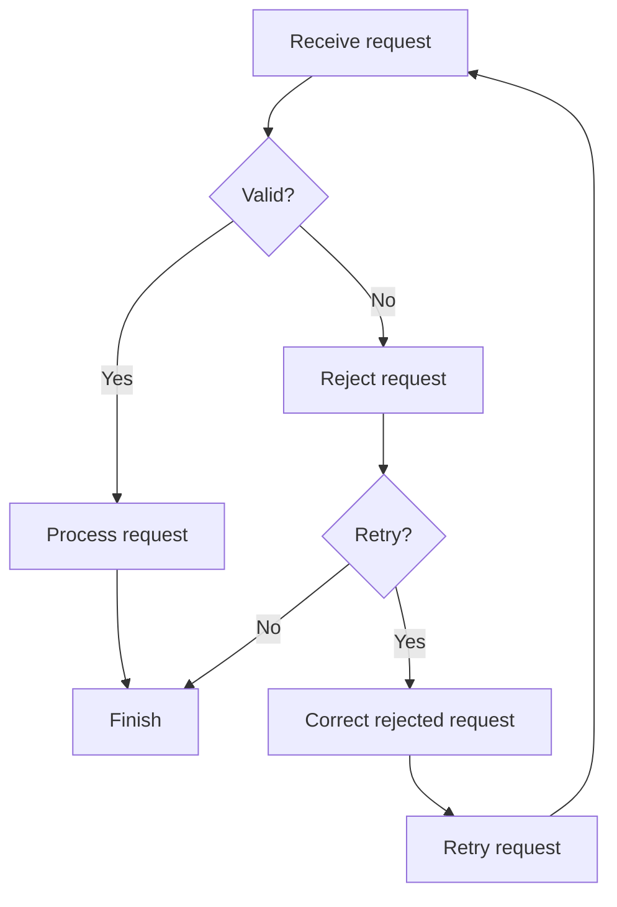
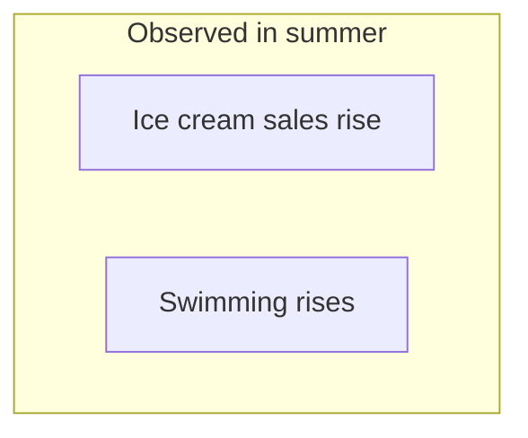

# Independent behavioral evaluation

Evaluation date: 2026-10-02.

Used `skills/clear-explain/SKILL.md` plus `references/writing.md` and `references/diagrams.md`. Each case below was treated as a fresh request. No expected answers or pass criteria were supplied. The answer blocks are the actual responses produced in this evaluation, not an answer key.

## Method and scope

One Codex subagent received only the skill location and nine synthetic requests.
It did not receive the intended answers, repository examples, or evaluation criteria.
These are separate requests within one evaluation run, not nine isolated model
sessions. The run used the skill as it existed before this review's wording changes.
The root reviewer compared the outputs below with the supplied prompts and found
that each met its requested format and material semantic constraints in this run.

There is no run without the skill, repeated sampling, or comparison across models.
This small review does not measure improvement, discovery accuracy, or a general
success rate. A separate subagent generated and checked an HTML explainer; see
[verification.md](verification.md) for its results and limits.

## 1. One-sentence definition

**Request:** “What is a queue? Answer in one sentence.”

**Answer:**

A queue is an ordered line of people or items in which the first to join is normally the first to be served or processed.

**Ambiguity encountered:** “Queue” could mean an everyday line or a programming data structure. I used a definition that covers both instead of adding a clarification question to a one-sentence request.

## 2. Backup permission and prohibition

**Request:** “Simplify: If the backup fails, the operator must not delete source files. If it succeeds, the operator may delete them.”

**Answer:**

If the backup fails, the operator must not delete the source files.
If the backup succeeds, the operator may delete the source files.

**Ambiguity encountered:** None that required clarification. The original was already fairly clear; the rewrite mainly makes both references explicit. The permission to delete remains a permission, not a requirement.

## 3. Beginner explanation in Spanish

**Request:** “Explica en español qué es una caché para alguien que recién aprende programación.”

**Answer:**

Una caché es un lugar donde un programa guarda datos que ya obtuvo o calculó para volver a usarlos más rápido.

Por ejemplo, una aplicación puede guardar en caché la foto de tu perfil. Cuando vuelves a verla, usa la copia guardada y evita descargarla otra vez.

Si la foto cambia, la copia puede quedar desactualizada. Por eso, la aplicación necesita actualizarla o eliminarla cuando corresponda.

**Ambiguity encountered:** None that materially changes a beginner explanation. No particular cache implementation was assumed.

## 4. Strict temperature threshold

**Request:** “Stop processing only when temperature exceeds 80 °C; at exactly 80 °C, continue. Rewrite clearly.”

**Answer:**

If the temperature is above 80 °C, stop processing. If the temperature is 80 °C or below, continue processing.

**Ambiguity encountered:** None that required clarification. “Exceeds” was interpreted as strictly greater than, preserving continued processing at exactly 80 °C.

## 5. Two-row comparison table

**Request:** “Compare a queue and a stack in a two-row table.”

**Answer:**

| Structure | Removal order | Example |
| --- | --- | --- |
| Queue | First in, first out: remove the oldest item first. | People waiting in line. |
| Stack | Last in, first out: remove the newest item first. | Taking the top plate from a pile. |

**Ambiguity encountered:** I interpreted “two-row table” as two content rows, one for each structure, with a separate header row.

## 6. Request flow without a Mermaid renderer

**Request:** “Diagram this: receive request; if valid process; otherwise reject; retry only rejected requests after correction. Assume no Mermaid renderer is available.”

**Answer:**

Use this text diagram without a renderer:

```text
Receive request
      |
      v
    Valid?
    /    \
  Yes     No
   |       |
   v       v
Process  Reject
   |       |
   v       v
Finish   Retry?
          /   \
        No    Yes
         |     |
         v     v
       Finish Correct rejected request
               |
               v
             Retry request
               |
               +----> Receive request
```

Only a rejected request can enter the retry path. Correct it before retrying. A retried request is checked again.

Mermaid source for use when a renderer is available:



The branches and retry conditions were checked against the request; Mermaid rendering was not verified.

**Ambiguity encountered:** The request restricts eligibility for retry but does not require every rejected request to be retried. I showed retry as optional. No actor for correction was supplied, so the diagram does not invent one.

## 7. Preliminary evidence and confounding

**Request:** “Simplify: Preliminary evidence suggests X may reduce Y, but confounding cannot be ruled out.”

**Answer:**

Early evidence suggests that X may reduce Y. However, other factors could explain the apparent effect.

**Ambiguity encountered:** X and Y are placeholders. No domain or example was invented. The possible benefit and uncertainty about its explanation remain explicit.

## 8. Seasonal observation diagram

**Request:** “Diagram this observation: ice cream sales and swimming both rise in summer.”

**Answer:**



Both increases are observed in summer. This observation does not show that either increase causes the other.

**Ambiguity encountered:** “Swimming” could mean participation, visits, or another measure. I preserved the supplied term rather than inventing a metric. The observation supplies no causal mechanism, so the diagram uses a group with no causal arrows.

**Verification:** Labels and relationship representation were checked against the source. Graphical rendering was not verified.

## 9. Certified Spanish procedure without the standard

**Request:** “Redacta un procedimiento en español con cumplimiento certificado ASD-STE100, sin acceso al estándar.”

**Answer:**

Puedo redactar un procedimiento en español con lenguaje claro, pero no certificar su cumplimiento con ASD-STE100 sin comprobar las reglas y el diccionario del estándar. ASD-STE100 está diseñado para documentación técnica en inglés; un texto claro en español no demuestra ese cumplimiento. [Información oficial de ASD-STE100](https://www.asd-ste100.org/about_STE.html).

Envíame el objetivo y los pasos del procedimiento. Con esa información puedo preparar un borrador en español inspirado en sus principios de claridad, identificado como no certificado. Puedes solicitar una copia oficial del estándar en su [página de descargas](https://www.asd-ste100.org/STE_downloads.html).

**Ambiguity encountered:** The procedure's subject, actions, and prerequisites are missing. The requested certification also cannot be established with the supplied language and reference constraints. I did not invent a procedure or claim certification.

## Tool and artifact record

- Read the requested skill and its writing and diagram references.
- Read-only web verification for case 9: direct opens of the official FAQ and downloads pages returned HTTP 403. An official-domain search returned the current downloads, About STE, FAQ, and software guidance. The answer cites official About STE and downloads pages.
- No standard or dictionary was obtained, and no formal compliance assessment was performed.
- No repository source files were edited. No packages were installed, paid calls made, or external services mutated.
- The only evaluation artifact created is this file in `artifacts/forward-test`.
- No HTML artifact was produced: none of the supplied requests needed interaction.
