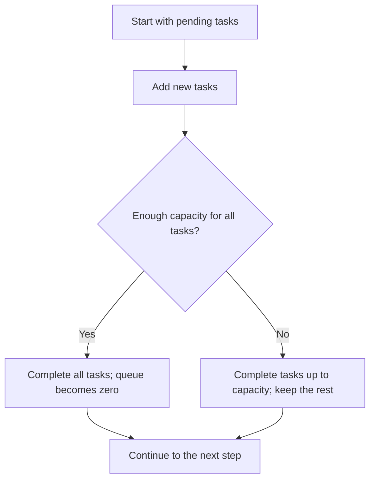

# Diagrams that explain relationships

Use a flowchart for decisions, a sequence diagram for exchanges between actors,
a state diagram for transitions, and a dependency graph for prerequisites.
For comparisons, a table is often simpler. Do not force a hierarchy into a flowchart.

## Build the mental model

- Identify actors, actions, conditions, and outcomes from the source first.
- Give arrows a consistent meaning: order, message, dependency, or causation.
  Do not silently mix meanings or present correlation as causation.
- Phrase action nodes as actions. Phrase decision nodes as questions and label exits.
- Show relevant failure, retry, and alternative paths. Omit unrelated detail.
- Split a graph when it requires tiny labels or long crossings to fit.
- State its scope and provide a brief text explanation for readers who cannot see it.

## Mermaid when supported

Use stable ASCII node IDs and quote human-readable labels. Favor basic syntax
unless the environment supports more recent features. Avoid lowercase `end` as a
flowchart ID. Do not include executable links or imported directives from untrusted
source material.

Example: one step of an illustrative work queue. Work arrives before processing.

Fallback text: add arrivals to the pending tasks. Process up to the available
capacity. Carry remaining tasks into the next step. This toy model excludes
abandonment, prioritization, and variation between tasks.

## Verification

Render with available local tools or the host's renderer. Check labels, reading
order, branch conditions, and layout. A syntax check alone does not prove fidelity
to the source. If no renderer is available, provide Mermaid source and the text
alternative; do not claim that visual rendering was checked.

[Mermaid flowchart documentation](https://mermaid.js.org/syntax/flowchart.html)
